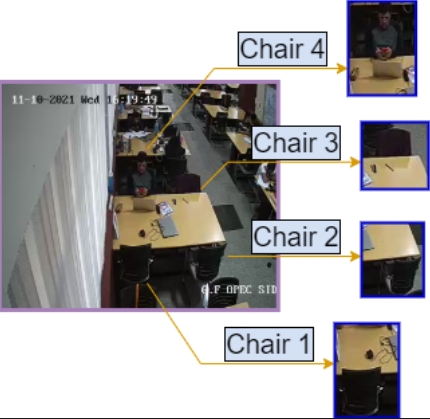
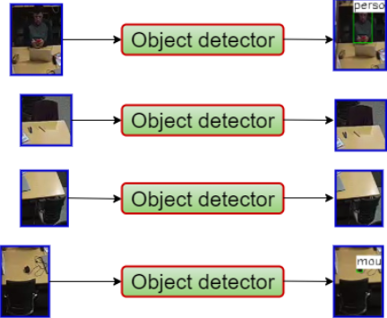
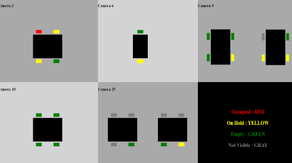

# Library Seat Occupancy Detection

This repo provides a method of seat occupancy detection in the library, using Computer Vision techniques on the images of IISERB library to map which seats are available while leveraging existing surveillance camera infrastructure.

## Problem Definitiion
The challenge was to build an AI system that uses the library's CCTV footage to output the seat status of every seat of the library in almost real-time. Then to update the seat status on a website for all IISERB members to access.

## Method  
There are 4 major steps,

- **Data Collection**  
The CCTV data from the IISERB library was obtained at 4 different instances of time.

- **ROI (Region of Interest) Definition & Cropping**  
Converted the bitmap images to jpeg and then all images were resized to ensure consistency. Finally, We cropped the defined ROIS from the images.

- **Object Detection**  
We used a pre-trained object detection model called the YOLOv4-p6. YOLOv4 is a real-time object detection model published in April 2020
that achieved state-of-the-art performance on the COCO dataset.
  
Each ROI was passed into the object detection function with a confidence threshold and NMS frequency. The function returned the class id, Confidence level, and location of every detected object in the given image.
    - If the object detection phase returned a “person” as one of the multiple objects detected, then the seat was marked as “OCCUPIED” (corresponds to the status value of 1).
    - If the object detection returned an empty dataframe, then we concluded that the seat was not “OCCUPIED”, for certain, and thus it could be either “ON HOLD” (corresponds to the status value of 2) or “EMPTY” (corresponds to the status value of 0)
        - Now, the smaller ROIS were passed to the object detection phase. If, once again, the dataframe returned was empty, then it was concluded that the seat was “EMPTY”. 
        - If any object was detected within the smaller ROI, then the seat was marked as “ON HOLD”.

- **Website**  
All this information was update onto an html page.

 

### Results
The model accurately predicted the seat status of 76.25% of the selected seats in the library, on average. This, roughly, translates to 15 seats out of 20 seats per instance of data.
